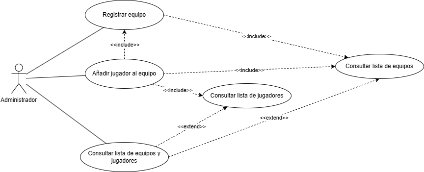
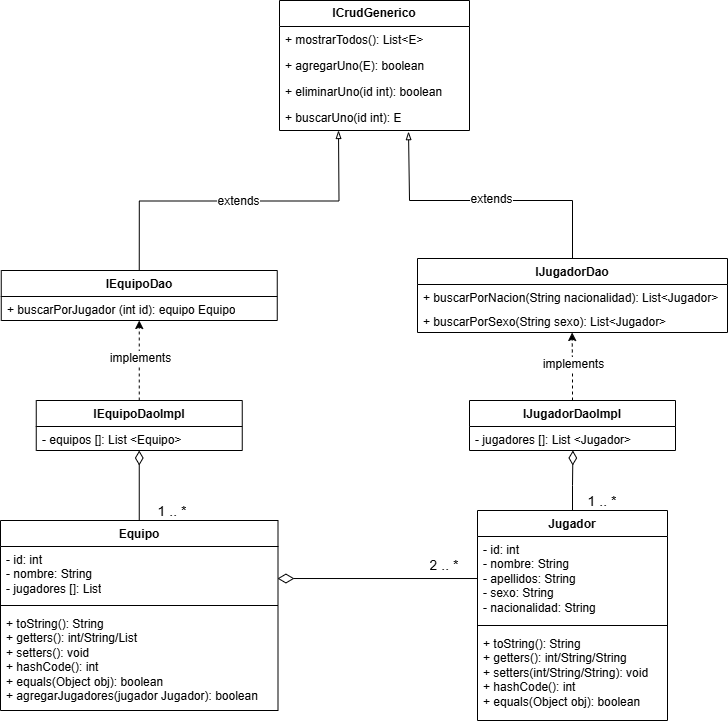

# Sistema de Gestión de Torneos de eSports
## Autor
Andrea Amado Lain

Github: Andrie42
## Descripción del Proyecto
https://github.com/Andrie42/torneo-esports-uml.git

Este proyecto implementa un sistema de gestión de torneos de eSports
utilizando UML para el modelado y Java para la implementación.
## Diagramas UML
### Diagrama de Casos de Uso

### Diagrama de Clases

## Estructura del Proyecto
torneo-esports-uml/ ├── src/
│ ├── es/empresa/torneo/
│ │ ├── modelo/
│ │ ├── control/
│ │ ├── vista/
│ │ ├── Main.java
├── diagrams/
│ ├── casos-uso.png
│ ├── clases.png
├── README.md
├── .gitignore
├── LICENSE

## Instalación y Ejecución
1. Clonar el repositorio:
   `git clone https://github.com/andrie42/torneo-esports-uml.git`
2. Compilar y ejecutar el proyecto:
   `cd src javac es/empresa/torneo/Main.java java es.empresa.torneo.Main`
## Justificación del diseño
Elegí la estructura de modelo DAO de programación orientada a objetos porque se trata de una estructura con la que estoy familiarizada, la cual facilita la organización y la ampliación del sistema con más métodos y clases. A continuación una explicación más detallada del diseño:

1. Análisis del problema y requisitos del sistema:
    * ¿Quiénes son los actores que interactúan con el sistema?
   
      Los actores que interactúan con este sistema son los administradores de los torneos de eSports. Aunque, dependiendo del enfoque que el cliente le diese a este sistema, también podrían interactuar con él los líderes de equipo, pero con unas acciones diferentes y mas restringidas.

    * ¿Cuáles son las acciones que cada actor puede realizar?

      Las principales acciones que los administradores pueden realizar con el sistema son:
        - Registrar un equipo
        - Añadir jugadores al equipo
        - Comprobar el listado de equipos y jugadores
        - Generar partidas
        - Crear emparejamientos de equipos para las partidas
        - Registrar los resultados de partidas
        - Registrar penalizaciones de equipos y/o jugadores
        - Registrar bajas de jugadores y/o equipos

      En caso de que también se incorporasen como actores a los líderes de equipos, podrían realizar las siguientes acciones:
        - Realizar petición de registro del equipo a torneos.
        - Modificar datos del equipo.
        - Registrar jugador en su equipo.
        - Reportar baja del equipo y/o de un jugador del equipo.
        - Reportar una falta/infracción de otro equipo.

    * ¿Cómo se relacionan entre sí las entidades del sistema?

      Un equipo solicita registrarse a un torneo, el administrador procede a aceptar o denegar su petición y, en caso de aceptarla, registra al equipo y sus jugadores y lo empareja con otro en una partida de ese torneo (los cuales el administrador ha creado con el sistema de gestión con anterioridad). Una vez terminada la partida, el administrador registra el resultado y empareja al equipo ganador con otro en una nueva partida de la siguiente fase del torneo. Este último proceso se repite hasta que queda un solo equipo ganador del torneo.

2. Identificación de los casos de uso y elaboración del diagrama
    Gestión de equipos y jugadores:
    - Registrar equipo: tal y como se muestra en el diagrama, para realizar esta acción, primero se comprueba la lista de equipos para cerciorarse de que ese equipo no está ya registrado (o existe otro equipo con el mismo nombre).
    - Añadir jugadores a un equipo: al igual que con la acción de registrar un equipo, antes de registrar un jugador se comprueba que no esté registrado todavía y se haya duplicado la petición de registro por algún error. También se comprueba si el equipo al que se está registrando existe en el sistema. Antes de realizar esta acción, se debe haber registrado algún equipo (como se indica en el diagrama con la flecha de <<include>>), ya que no se puede registrar un jugador en un equipo si no hay ningún equipo registrado.
    - Consultar lista de equipos y jugadores: aunque en un principio podría pensarse que para realizar esta acción primero se deberían registrar equipos y jugadores, no es del todo necesario, ya que se puede mostrar la lista vacía de jugadores y equipos (podría darse el caso en el que un administrador quiera comprobar si un torneo o partida está vacío, de darse así, podría mostrarse un mensaje en el sistema tipo “No se han registrado jugadores/equipos en este torneo/partida”).

3. Identificación de clases y relaciones
   En el caso de uso tratado anteriormente, tenemos las siguientes clases principales
   * Entidades:
     - Jugador: con los atributos id (integer), nombre (String), apellidos (String), sexo (String) y nacionalidad (String); y con los métodos estandar de una clase entidad (getters y setters, toString, hashCode y equals).
     - Equipo: id (int), nombre (String) y jugadores (List); y, además de los métodos propios de este tipo de clases (mencionados en la clase jugador), un método propio llamado agregarJugadores(jugador Jugador): boolean, que recibe un objeto de la clase Jugador y devuelve un boolean (true si se ha registrado correctamente y false si no lo ha hecho).
   * Control:
     - IEquipoDaoImpl: esta clase alberga el listado de todos los objetos de la clase Equipo e implementa los métodos de la interfaz IEquipoDao.
     - IJugadorDaoImpl: esta clase alberga el listado de todos los objetos de la clase Jugador e implementa los métodos de la interfaz IJugadorDao.
   * Interfaces:
     - IEquipoDao: contiene el método ‘buscarPorJugador (int id): equipo Equipo’, que sirve para buscar un equipo a partir de un jugador. Este recoge el atributo id del jugador y devuelve el objeto de la clase Equipo correspondiente. Además, hereda los métodos de la interfaz padre ICrudGenerico
     - IJugadorDao: contiene el método ‘buscarPorNacion(String nacionalidad): List<Jugador>’, que recoge el nombre de una nacionalidad y devuelve un listado con todos los jugadores de esa nacionalidad (sin importar si son de diferentes equipos); también el método ‘buscarPorSexo(String sexo): List<Jugador>’, que recoge un String con el sexo que se quiere buscar y devuelve un listado con todos los jugadores de ese sexo (también sin importar si son de diferentes equipos). Además, hereda los métodos de la interfaz padre ICrudGenerico.
     - ICrudGenerico: contiene los siguientes métodos típicos de este tipo de interfaces:
       - mostrarTodos(): List<E>
       - agregarUno(E): boolean
       - eliminarUno(id int): boolean
       - buscarUno(id int): E

## Conclusiones
Con este proyecto he aprendido la importancia de diseñar la estructura y funcionamiento de un sistema o programa antes de construirlo, no solo evita posibles problemas que se enfrentarían construyéndolos directamente, sino que también agiliza el proceso de construcción al tener ya una idea clara de este. También es una forma de explorar diferentes formas de construir dichos sistemas o programas sin invertir demasiado tiempo en ello y elegir la que se considere más adecuada.